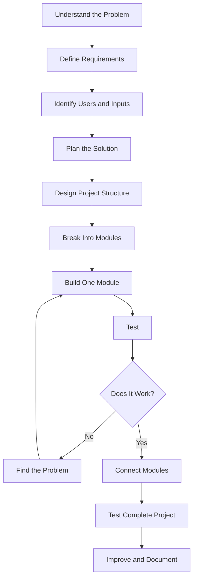
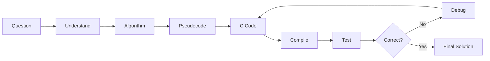

# Ganapa Day 2

Today I spent time learning how to read and understand a project before trying to change it.

I realised that when we get a project, especially a project with many files and different parts, it is easy to start changing things immediately. But that can create more problems if we do not understand how the project is connected.

So today I focused on understanding the structure first.

I tried to look at the project as a whole and understand what each important file is doing, where the main code starts, how different parts are connected, and where I should look when I find a problem.

One thing I learned is that reading a project is also a technical skill.

We don't always need to understand every single line before we can work on something. First, we need to understand the bigger picture. Then we can go deeper into the part that actually needs to be changed.

## How I want to solve problems in C

When I get a C programming problem, I don't want to immediately start writing code. I want to understand the problem first.

My basic process is:

**Understand the problem → Identify the input → Identify the expected output → Break the problem into smaller steps → Write the logic or algorithm → Write the C code → Compile and test → Find and fix errors → Check the result**

There are different types of problems I need to recognise too. Sometimes the problem is a syntax error. Sometimes the logic is wrong. Sometimes the program runs but gives the wrong output. Understanding which type of problem I have makes debugging easier.

For example, if a program is not compiling, I should first check the error message, syntax, brackets, semicolons, variable names, data types, and function structure. If it compiles but gives the wrong answer, I should look more closely at the logic and test the program with simple inputs.

## How I want to structure a project

I also learned that solving one programming question and building a complete project are different things.

For a project, I should first understand the problem that I am trying to solve. Then I need to identify the users, requirements, inputs, outputs, main features, data, and technologies. After that I can design the structure, divide the project into smaller modules, build one part at a time, test each part, and finally connect everything together.

The structure I am learning is:

For a C programming problem, the smaller process looks like this:

This made me realise that good programming is not only about knowing syntax.

It is also about thinking clearly, breaking a big problem into smaller problems, understanding how the parts connect, testing the result, and learning from errors.

Today was less about writing new code and more about learning how to read existing work properly.

I want to improve this skill because real development is not always about starting from an empty project. Many times, we have to understand something that someone has already built, find the problem, and then make the right change.

My main learning from today is simple.

**Before solving a problem, understand the problem and the structure first.**

If I can learn to read projects better, break problems into smaller parts, and debug step by step, I can become much more confident with C and project development.

**Ganapa Day 2**

**Date:** October 7, 2026
