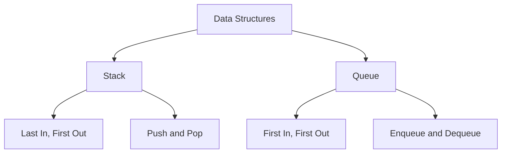

# Ganapa Day 4

Yesterday I spent time studying Stack and Queue in college, and I wanted to understand the topic properly so I could explain it to other people in a simple way.

I learned how both data structures can be built using Python lists. They both store items, but the way we add and remove items is different.

## Understanding a Stack

A stack works on the Last In, First Out idea. The last item added is the first item removed.

For example, imagine putting books on top of one another. If I put book 10 first, then book 20, and then book 30, the first one I take off the top is book 30.

The main operations in the program I studied are:

- `push(item)`: adds an item to the stack.
- `pop()`: removes the top item.
- `peek()`: checks the top item without removing it.
- `is_empty()`: checks whether the stack has any items.
- `display()`: shows the stack from top to bottom.

If we try to remove an item when the stack is empty, the program handles it by showing a stack underflow message.

## Understanding a Queue

A queue works on the First In, First Out idea. The first item added is the first item removed.

Think about people waiting in a line. The person who joins first is served first.

The main operations in the program are:

- `enqueue(item)`: adds an item at the rear of the queue.
- `dequeue()`: removes an item from the front.
- `is_empty()`: checks whether the queue is empty.
- `display()`: shows the items from front to rear.

The program also checks for an empty queue before removing an item, so it can show a queue underflow message instead of trying to remove something that is not there.

## The difference

A simple way to remember it is:

**Stack: the newest item comes out first.**

**Queue: the oldest item comes out first.**

## What I want to share with others

I don't want to learn a topic only to remember it for an exam. I want to understand it well enough to explain it to another student using a simple example.

If I can explain the difference between a stack and a queue without looking at my notes, that will show me that I understand the concept better.

My next step is to run the program, change the values, test what happens when the stack or queue is empty, and practise explaining each operation in my own words.

Today's learning reminded me that teaching a concept simply is also a good way to check my own understanding.

**Ganapa Day 4**

**Date:** October 9, 2026
